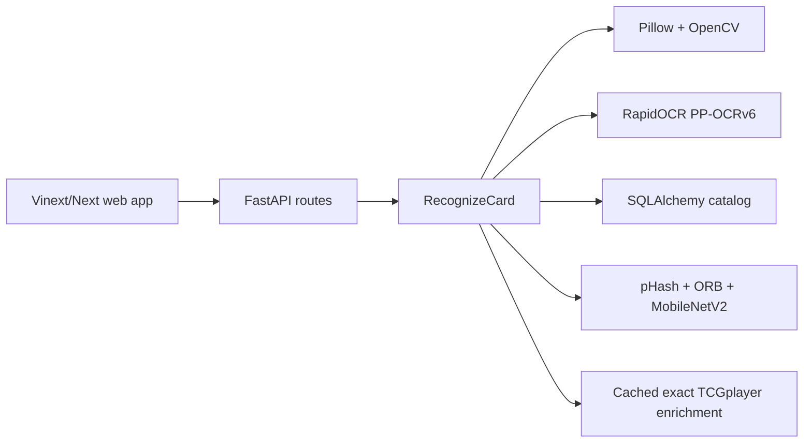

# Architecture

PokéLens preserves clean architecture: domain protocols own the boundaries, the application use case coordinates them, and infrastructure adapters implement OCR, vision, data, and pricing.

`backend/app/core/container.py` is the only backend-selection point. The default is `paddle` OCR plus the `composite` artwork matcher. The original custom CTC OCR and ONNX embedding adapters remain selectable without changing the use case or HTTP contract.

TCGdex is behind a catalog-provider protocol. Builder, reference asset preparation,
feature generation, and import are offline setup stages. Recognition itself is
image-stateless: request bytes are released after processing, model sessions and
the catalog-wide visual matrix live for the process, text and vector searches run
concurrently, and expensive geometric comparison is bounded to eight candidates
and cached. After selection, one bounded marketplace request may refresh an exact
product mapping and price cache. Provider errors fall back to cached or unavailable
pricing and never change the recognition outcome.

The frontend validates responses with Zod at the trust boundary. Pricing, marketplace mappings, Redis, and custom models are independent capabilities; only OCR, artwork matching, database access, and a non-empty catalog determine recognition readiness.
