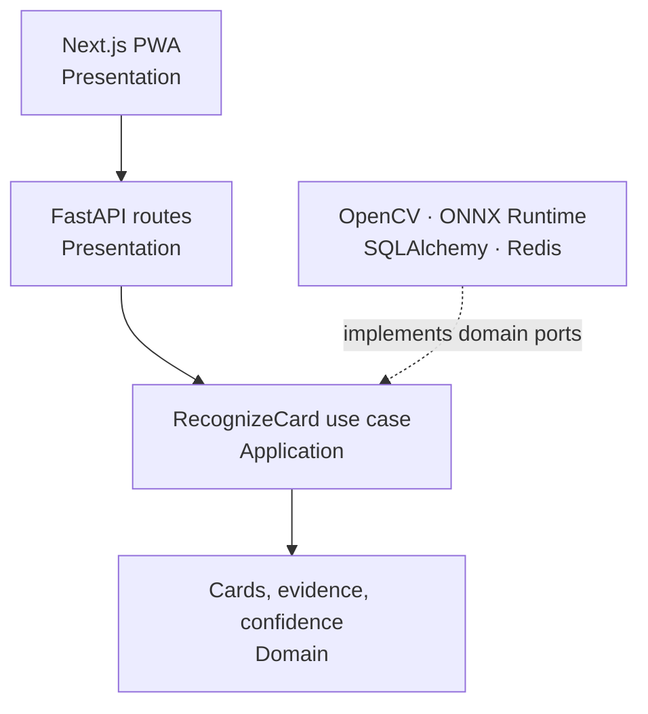

# Architecture

PokéLens follows clean architecture. Dependencies point inward; frameworks and model runtimes implement domain-owned protocols.



## Repository layout

```text
app/                     Next.js routes, manifest, metadata
components/              Scanner and small UI components
lib/                     Zod contracts and HTTP client
public/                  PWA worker and static brand assets
backend/app/api/          Versioned HTTP schemas and routes
backend/app/application/  Recognition orchestration and policies
backend/app/domain/       Framework-independent models, errors, ports
backend/app/infrastructure/
  database/              SQLAlchemy records and repositories
  imaging/               Upload validation and OpenCV localization
  models/                ONNX OCR and artwork adapters
backend/tests/            Unit and integration coverage
ml/                      PyTorch model definition and ONNX export
docs/                    Operational and engineering contracts
```

## Composition

`backend/app/core/container.py` is the only composition root. It selects concrete adapters and hands them to the use case through domain protocols. Replacing an OCR architecture, embedding network, database implementation, or price source does not change the API or recognition orchestration.

The web application validates the response again with Zod. Backend Pydantic models and frontend Zod schemas intentionally duplicate the wire contract at the trust boundary; neither side imports framework-specific types from the other.

## Scalability boundaries

- The API is stateless with respect to images. Upload bytes live only for the request.
- PostgreSQL owns the normalized catalog and price cache.
- Redis coordinates rate limits and can later support short-lived recognition work queues.
- Model sessions are process-scoped and lazily loaded, avoiding per-request initialization.
- Candidate retrieval is indexed and bounded before artwork comparison.
- Background catalog and price ingestion are separate from the latency-sensitive scan request.

Accounts, history, collections, binder scanning, grading, and social features are deliberately absent.
