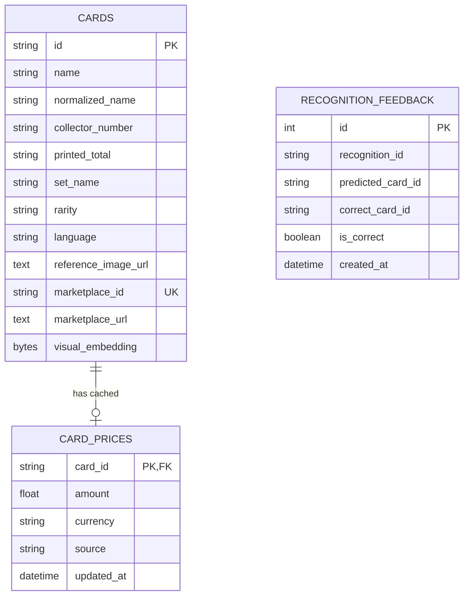

# Database schema

PostgreSQL is the production database. SQLite is supported only for low-friction local development and tests.

`cards(collector_number, normalized_name)` is indexed for bounded candidate retrieval. Marketplace identifiers are unique. Embeddings are stored as contiguous float32 bytes and decoded only for the already-bounded candidate set.

Catalog ingestion uses `backend/scripts/import_catalog.py`. Production imports should run into a staging database, validate counts, uniqueness, URLs, embedding dimensions, and set/number coverage, then swap or promote transactionally. Recognition never imports or refreshes catalog data inline.

Price refresh is a separate scheduled worker responsibility. It writes the latest successful value and timestamp; expired or missing prices render as unavailable while recognition remains functional.
