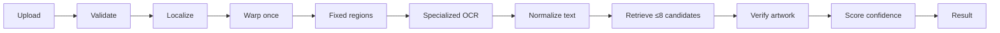

# Recognition pipeline

One request runs one deterministic preprocessing pass:

## 1. Validation

The server checks declared MIME type, actual image format, byte limit, minimum dimensions, decompressed pixel count, and image integrity. Unsupported or suspicious uploads stop before OpenCV or a model session is invoked.

## 2. Localization and normalization

`OpenCvCardLocator` downsizes only very large inputs, detects external contours, retains plausible convex card quadrilaterals, rejects multiple-card frames, orders four corners, and warps directly to 744×1039. Already cropped portrait card images take a deterministic resize path. Blur is measured on the normalized card with Laplacian variance.

No preprocessing variant fan-out is performed. The normalized image is split into three fixed regions:

- top 18% for card-name OCR;
- bottom 24% for collector-number OCR;
- central artwork band for embeddings.

## 3. OCR and normalization

Separate CTC ONNX sessions read top and bottom regions. Text normalization handles Unicode form, spacing, punctuation noise, known suffix spacing (`VMAX`, `VSTAR`, `GX`, `EX`/`ex`), leading zeros, slash confusion, and conservative character confusion in collector numbers.

## 4. Candidate retrieval

PostgreSQL searches indexed `collector_number` and `normalized_name` fields and returns at most eight rows. The system never performs embedding comparison against the complete catalog.

## 5. Artwork verification

The scan artwork is embedded once by a PyTorch-trained, ONNX-exported metric model. Each candidate has a precomputed embedding. Cosine similarity independently verifies text evidence and enables new catalog additions without classifier retraining.

## 6. Confidence

The explainable policy combines collector evidence, name evidence, OCR quality, and artwork similarity. Artwork is required to cross the high-confidence threshold. A top result must also lead the runner-up by the configured margin. Defaults:

- matched: score ≥ 0.82 and margin ≥ 0.08;
- ambiguous: score ≥ 0.56 but not safely matched;
- unrecognized: no score reaches 0.56.

These values are configuration in code but are not product truth until calibrated against the benchmark dataset. Promotion changes must include a benchmark report.

## Timings

Request middleware records total time. Production instrumentation should additionally emit validation, localization, OCR, candidate retrieval, artwork, and pricing-cache timings using identifiers only. Uploaded bytes, OCR crops, and card images must never enter logs.
