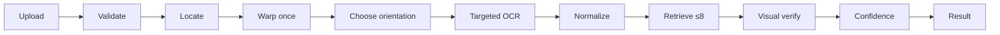

# Recognition pipeline

1. Pillow validates MIME, decoded format, byte and pixel limits, dimensions, and integrity.
2. OpenCV downsizes only oversized inputs, detects a visible card quadrilateral, rejects distinct multiple cards, perspective-warps once to 744×1039, and measures localization/blur quality.
3. Because localization normalizes every card to portrait, the orientation resolver
   reads the upright name first and tries 180° only when that reading is weak. It
   reads the collector strip once after choosing the orientation, reducing the
   usual OCR work from six calls to two.
4. RapidOCR runs pretrained PP-OCRv6 only on configurable name and collector crops. One resize and optional grayscale histogram equalization are the only preprocessing variants.
5. Unicode, punctuation, suffixes, collector formats, and bounded contextual OCR alternatives are normalized while raw OCR and real confidence remain available in development diagnostics.
6. Indexed exact/fuzzy text retrieval and a process-warmed catalog-wide visual index
   run concurrently. Their results are interleaved into at most eight candidates,
   so weak OCR can still recover the correct card without choosing a random record.
7. The normalized full card is processed once for pHash and a MobileNetV2 feature.
   Fast vectorized comparison produces the shortlist; more expensive ORB geometry
   is computed lazily only for those candidates and then cached.
8. Confidence adapts to the available evidence. Text and visual agreement remains
   the strongest route, while a clearly separated visual match can identify a card
   when OCR is poor. `ambiguous` still returns the most likely card and alternatives
   instead of forcing another upload; `unrecognized` is reserved for cases without
   reliable evidence. Missing required capability returns HTTP 503
   `recognition_unavailable`.

Structured logs record validation, localization/warp, orientation, name OCR, collector OCR, retrieval, artwork, price lookup, and total milliseconds. Images and crops are never logged. Development-only base64 diagnostics require both `POKELENS_DEVELOPMENT_DIAGNOSTICS=true` and `?debug=true`.

Thresholds are conservative defaults pending a representative benchmark; they are not accuracy claims.
